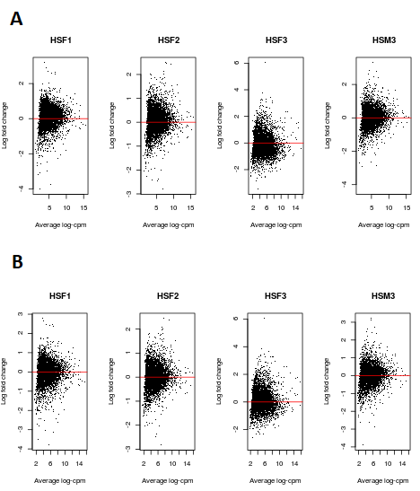
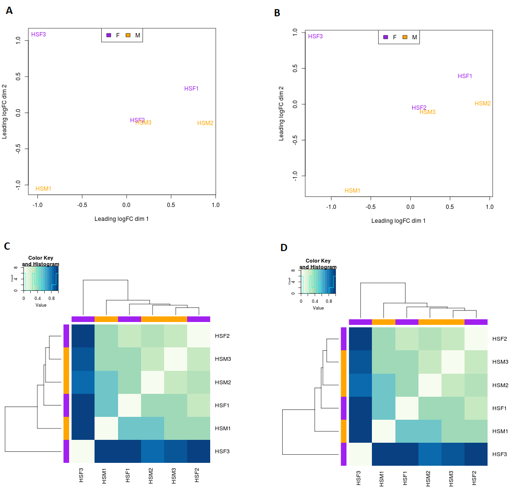

```{r, include=FALSE}
knitr::opts_chunk$set(
  echo = TRUE, warning = FALSE, error = FALSE, message = FALSE
)
```

```{r echo=FALSE}
# libraries
library(edgeR)
library(limma)
library(gplots)
library(AnnotationDbi)
library(org.Hs.eg.db)
library(RColorBrewer)
library(edgeR)
library(limma)
library(kableExtra)
library(tidyverse)
library(gridExtra)
library(grid)
library(DESeq2)
library(DEFormats)
```


```{r, echo = FALSE}
###############################
# Helper functions
###############################
#function to format printed numbers
formatgraph <- function(x) {
  formatC(x, format = "e", digits = 2)
}

#function to write matrix in markdown
write_matex2 <- function(x) {
  x <- as.matrix(x)
  begin <- "\\begin{bmatrix}"
  end <- "\\end{bmatrix}"
  X <-
    apply(x, 1, function(x) {
      paste(
        paste(x, collapse = "&"),
        "\\\\"
      )
    })
  paste(c(begin, X, end), collapse = "")
}

#saved data for RMD
load("data_report.Rdata")
```

# Introduction

@Blekhman use RNA-sequencing of female and male humans, chimpanzees, and rhesus macaques samples of liver cells to study sex-specific and lineage-specific changes in gene expression patterns. They identify individual genes whose regulation likely evolved under different scenarios of selection in primates: stabilizing selection regardless of the sex, directional selection in the human lineage regardless of sex and conserved sexually dimorphic expression patterns. In a subsequent analysis they study expression patterns at exon level to characterize differential and conserved alternative splicing between sexes and species. In this work, we use the data produced by the authors but retain the human samples annotated at gene level only and will therefore focus on differential expression between sexes.

## Hypothesis

Our working hypothesis is that sexual dimorphism in humans is reflected in a different pattern of genes expression. There are genes in liver tissues that are differentially expressed between sexes in humans. This hypothesis differs from the ones in @Blekhman, where the authors work on differential expressions under different natural selection scenarios across species and sexes. 

## Objective

We want to understand the differences in genes expression between sexes among humans and determine what biological components, functions and processes they impact. To do so we want to find the differentially expressed (DE) genes and select among them a list of genes which expression pattern characterizes the difference between sexes. Once the list has been established, we want to find which biological components, functions and processes are particularly associated with those genes.

# Material and methods

## Data acquisition and experimental design

Our data is composed of RNA sequencing of 6 samples of human liver tissues, with 3 biological replicates for each sex, gathered and sequenced by @Blekhman. The samples were collected from healthy adults by the National Disease Research Interchange (NDRI). @Blekhman sequenced the samples using Illumina’s Solexa technology. Each sample was sequenced using two lanes distributed over multiple flow-cells. The authors processed the data from reads to counts and both raw data (sequence reads) and processed data (counts) can be downloaded from the Gene Expression Omnibus (GEO) database with accession number GSE17274. The original processed data for human samples had two technical replicates per biological replicate. However, we work from transformed count data where the technical replicates have been merged so eventually have a dataset of 6 biological replicates, 3 for each group: HSM1, HSM2, HSM3 are male samples and HSF1, HSF2, HSF3 are female samples. We then have a two-independent group design with a single factor, sex. The transformed count data has already been aligned to the human genome and annotated with ENSEMBL gene IDs.

## Filtering

We apply an independent filtering to our data based on the gene counts scaled by the total size of the library, count-per-million (cpm). We filter out genes with a cpm below our threshold in a minimum number of samples. Indeed, the data contains numerous genes with null or very low counts in most libraries that provide no useful information to identify differential expression between sexes. Including them in our analysis is harmful to our statistical work because the larger the number of genes the smaller the power of the statistical test after adjustment for multiple testing. Moreover, the presence of very lowly expressed genes can make estimation of the mean-variance relationship in the data less reliable. Independent filtering is a critical step of RNA-seq data analysis where important information can be lost, therefore in this work we discuss different thresholds for the cpm values, see Section 4.3.

## Quality control checks

We first check our data for the effect of library size and compositional bias. A common issue in RNA-seq data is large differences in total number of reads between samples that create a technical bias when testing for differential expression. A large difference in counts for a given gene between two samples might be an artifact caused by a much larger sequencing depth in one of the samples and differences in proportions in the libraries. We assess graphically the presence of a compositional bias plotting the total library size across samples and mean-difference plots on the log cpm values. We then check our data for homogeneity of count distribution across samples with boxplots of the samples distributions of the log cpm values and MA plot between samples of the same sex. Finally, we look for potential batch effect with different approaches: multidimensional scaling (MDS), principal component analysis, hierarchical clusterings on the matrix of counts and on the distance matrix between samples. We perform the quality control checks before and after the normalization described in the next paragraph.

## Normalization

RNA-seq data are affected by a range of technical biases, a normalization is needed. We normalize our count data with the trimmed mean of M-values (TMM) method. We choose this method firstly because it is a between-samples normalization method. Indeed, we are looking for differentially expressed genes so we want differences in normalized counts between samples to represent true differences in expression. We are not interested by within samples comparisons so do not correct for effects such as gene length and GC-content targeted by within sample normalizations. Among between-samples normalization, adjusting only for the total library size as we did with the cpm values is not enough because, even though it tackles the effect of total size, the method does not consider the bias introduced by the changing proportion of mRNA corresponding to a given gene across biological conditions. Adjusting for total library sizes only assumes is too sensitive to few highly expressed genes having a large share of total expression. According to the review by @evans, other families of between-sample normalization methods include normalizations by distribution/testing and normalizations by controls. The latter assumes the existence of control genes in the data, an information that we do not have. Normalization by controls is therefore not an option. 

Normalizations by distribution/test are based on the idea that non-DE genes should have, on average, the same normalized counts across conditions and normalization factors can then be computed by equilibrating expression levels for non-DE genes. If technical effects impact non-DE genes and DE genes alike, then we can normalize all genes with the same normalization factor as the non-DE genes. @evans showed that DESeq and TMM normalizations are among the best performing methods in terms of ability to detect differentially expressed genes and controlling false positives when their assumptions are met. In TMM, a reference sample is first chosen, then, for each of the other samples, the A values (mean log counts across the two samples) and the M values (log fold change in scaled counts), are computed. The more extreme values are trimmed to extract the expression of non-DE genes. The normalization factor is the weighted mean of M values for each genes, where the weights correct the heteroscedasticity of M values. Finally, normalization factors are scaled to multiply one. As we have seen, TMM assumes that technical effects impact non-DE genes and DE genes alike, but another important assumption is symmetry: the numbers of up-regulated and down regulated genes should be roughly equal. Those are two assumptions that we can make in our context of comparison of expression between male and females samples.

## Statistical analysis

### Differentially expressed genes and annotation

To estimate the genewise differential expression we use the variance modeling at the observational level (voom) approach implemented in R package `limma`. The principle of voom is to adapt the well-establish `limma` t-test methodology for microarrays to the context of RNA-Seq data. Voom fits, for each gene, a linear model to estimate the genewise log fold change in cpm values and an empirical Bayes method to moderate the standard errors of the estimated log fold change.

We have a two independent groups design with one group composed of 3 human males and one group composed of 3 human females. There is one factor, the sex with two levels: male and female. We then build a 6x2 design matrix, where 6 is the number of samples we have and 2 the number of levels of the factor sex. Each column of the design matrix is a dummy variable that tells us which of the two groups the sample belongs to, that is the level of our factor. In such parametrization of the design, the model has no intercept for it to be identifiable. For each gene, the log-counts per million (log-cpm) value for the gene in sample $i$ is:

$$y_i=\log_2(\frac{c_i+0.5}{L_i +1}10^6)$$

where $c_i$ is the normalized count for the gene in sample $i$, and $L_i$ is the library size in sample $i$.

The counts are offset away from zero by 0.5 to avoid taking the log of zero, and to reduce the variability of log-cpm for low expression genes. The library size is offset by 1 to ensure that $\exp(y_i)$ is strictly less than 1 as well as strictly greater than zero.

For each gene, the base linear model is then:

$$y_i = \beta_FF_{i}+\beta_MM_{i}$$

where $F$ is a dummy variable that takes value 1 if the sample is female, 0 otherwise; $M$ is a dummy variable that takes value 1 if the sample is male, 0 otherwise; 

Arrays 1, 2, 3 are female samples whiles arrays 4, 5, 6 are male samples. The model above corresponds to the parametrization with base design matrix $D$. 

$$D=`r write_matex2(as.matrix(design_wo_batch))`$$ 

In this parametrization, $\beta_F$ and $\beta_M$ are coefficients that can be interpreted as the effect on log-cpm of belonging to each group (F female, M male). In this analysis, we are looking to contrast the effect of sex, females against males. We want to test, for each gene, the null hypothesis:
$$H_0:\hspace{0.2cm}\beta_F - \beta_M = 0$$ 
Our contrast matrix $C$ is then a single vector $C$.

$$C=`r write_matex2(cont.matrix_wo_batch)`$$

In a subsequent stage of the analysis we change our base design matrix to take into account the presence of batch effect in our data as detailed in Section 4.2.

One of the main hypothesis of linear models is homoscedasticity. However, RNA-Seq data are counts and feature heteroscedasticity. Typically, large counts have much larger standard deviations than small counts and as a consequence log-cpm values cannot be treated as having constant variances. To solve this issue, voom models the mean-variance relationship to obtain precision weights. The weight are input in the linear model fitting and eliminate the effect of the mean-variance relationship in the log-cpm values. In voom, the weights are the results of modelling the mean-variance trend of the log-cpm values at the individual observation level, while the related limma-trend approach models the variance at the gene level.

The weight is the inverse of the predicted variance for the observation such that, observations with larger estimated variance have less weight than observation with smaller estimated variance. They are precision weight, and reflect the fact that observations with high variance are less reliable. The predicted variance is estimated in several steps that involve:

 * the fitting of a LOWESS model for the gene-wise mean-variance relationship based on the residual variance of gene-wise linear models on normalized counts.
 
 * the estimation of each observation standard deviation using the gene-wise linear model prediction and the fitted mean-variance model.

From the fitted linear models we obtain for each gene, the estimated log-fold change, the moderated t-statistics and their corresponding raw p-values. We adjust the raw p-values for multiple testing by the Benjamini-Holmberg method that minimizes the false discovery rate (FDR). We then discuss various methods to define a list of differentially expressed genes that use a combination of the estimated log-fold changes, raw and adjusted p-values (see Section 4.3). We also annotate our genes with the Entrez ID, Symbol and gene name using R package `org.Hs.eg.db`. In this annotation process, we filter out tags that contain multiple matches.


### Biological significance

Finally, to get a further insight into the biology behind our list of differentially expressed genes, we carry an over-representation analysis on Gene Ontology (GO) terms. In such analysis, the frequencies of GO terms associated to our differentially expressed genes are compared to the frequencies of those terms in the universe of genes (human genes in our case) in the GO database. We identify the over-represented GO terms for up-regulated and down-regulated genes separately, and for each of the GO domain: biological process, cellular component and molecular function. 

# Software and versions

```{r, eval = FALSE, echo = FALSE}
sessionInfo()
```

The versions of R and R packages we use are: R 3.6.3, limma 3.42.2, DESeq2 1.26.0, org.Hs.eg.db 3.10.0, AnnotationDbi 1.48.0, affy 1.64, Biobase 2.46.0, BiocGenerics 0.32.0, edgeR 3.28.1, DEFormats 1.14.0, GenomeInfoDb 1.22.1, GenomicRanges 1.38.0 and  BiocParallel 1.20.1.


# Results and discussion

## Data

```{r, echo = TRUE}
# data
load("dataset5_eset.RData")
seqdata <- read.table("dataset5_count_table.txt", header=TRUE, sep="\t")

# Pheno data
sampleinfo <- gilad.eset@phenoData@data
features_list <- gilad.eset@featureData@data

rownames(sampleinfo) <- c("HSF1","HSF2","HSF3","HSM1","HSM2","HSM3")

# Remove first two columns from seqdata
countdata <- seqdata[,-1]

# Store ENSEMBL GeneID as rownames
rownames(countdata) <- seqdata[,1]

# Rename samples
colnames(countdata) <- c("HSF1","HSF2","HSF3","HSM1","HSM2","HSM3")
```

We read the transformed dataset of raw annotated counts from the RData file `dataset5_eset`. The counts dataset has `r nrow(countdata)` rows, each corresponding to an ENSEMBL gene and `r ncol(countdata)` columns, each corresponding to a sample.


```{r, echo = FALSE, eval = FALSE}
# Print top rows of data
count_df <- data.frame(countdata)

kable(count_df %>% top_n(6), "latex",
  booktabs = T,
  caption = "\\label{tab:tab1} First rows of the count table", 
  escape = FALSE,
  col.names = substr(colnames(count_df), start=1,stop=6)
) %>%
  kable_styling(
    latex_options = c("hold_position", "condensed")
  )
```

## Filtering, quality control and normalization

***Filtering***

```{r, echo = TRUE}
# Obtain CPMs : Calculate counts-per-million (cpm) (not log scale)
myCPM <- cpm(countdata)

# threshold based on a raw count of 10
thresh_val <- 10*1000000/min(colSums(countdata))
thresh <- myCPM > thresh_val

# average between 1 and threshold based on a raw count of 10
tresh_val2 <- mean(c(1,thresh_val))
thresh2 <- myCPM > tresh_val2

# we would like to keep genes that have at least 3 TRUES in each row of thresh
keep <- rowSums(thresh2) >= 3
# Subset the rows of countdata to keep the more highly expressed genes
counts.keep <- countdata[keep,]
```

To define the threshold for cpm values, we combine two frequently used approaches to filtering on cpm. One of them is setting the cpm threshold at 1, $t_{cpm,1}=1$. The other one is to define a threshold that represents a raw count of about 10 for the sample with the smallest library size in the dataset:

$$t_{cpm,2} = \frac{10\times10^{6}}{\min_j{\{L_j\}}}$$
where $L_j$ is the library size of sample $j$.

We obtain $t_{cpm,2}=$ `r round(thresh_val,2)`. Filtering by a value as high as `r round(thresh_val,2)` might remove a lot of genes. To minimize the loss of genes, we use the mean of $t_{cpm,1}$ and $t_{cpm,2}$ as our initial threshold value: $t_{cpm}=$ `r round(tresh_val2,2)`. Moreover, we wish to analyze genes that are at least completely expressed in one of the groups in our design. We have a two-group design with 3 samples in each group, so we keep genes which cpm values larger than our threshold in at least 3 samples. This initial filtering removes 46 353 genes and keeps 6227.


***Quality control***

```{r}
# DEG object
y <- DGEList(counts.keep)
```

```{r,eval=FALSE}
################################ 
# Quality control on raw counts
################################

##### library size #####

### bar plot
barplot(y$samples$lib.size,names=colnames(y),las=2,
        main = "Library sizes before normalization")

### MD plots
# Get log2 counts per million
logcounts <- cpm(y,log=TRUE)
# plots
op <- par()
par(mfrow=c(1,2))
plotMD(logcounts,column = 1, main=colnames(y)[1])
abline(h=0,col="red")
  plotMD(logcounts,column = 2, main=colnames(y)[2])
abline(h=0,col="red")
par(mfrow=c(1,2))
plotMD(logcounts,column = 3, main=colnames(y)[3])
abline(h=0,col="red")
plotMD(logcounts,column = 4, main=colnames(y)[4])
abline(h=0,col="red")
par(mfrow=c(1,2))
plotMD(logcounts,column = 5, main=colnames(y)[5])
abline(h=0,col="red")
plotMD(logcounts,column = 6, main=colnames(y)[6])
abline(h=0,col="red")
par(op)
```

Before normalization, the differences in library sizes are up to a `r round(100*(max(colSums(countdata))-min(colSums(countdata)))/min(colSums(countdata)))`%, between the largest and the smallest, which generates a composition bias as illustrated in the MD plots in Fig. \ref{fig:fig1}. In the MD plots, the log-fold change in cpm values of each sample (y axis) is represented against the average log-expression across the dataset (x axis). The samples HSF1, HSF2 and HSM3 are not centered at 0 but shifted at higher values. The sample HSF3 is not centered at 0 either but shifted at a lower value. In those samples, the counts are biased upward and downward respectively in comparison to the average counts. The MD plots for HSM1 and HSM2 are not reported here because they did not show any bias. We do not reproduce the bar plot of total library sizes for the sake of conciseness.

```{r,eval=FALSE,echo=FALSE,include=FALSE}
# for reporting purpose only
png("md_plots_bn_an.png")
par(mfrow=c(2,4))
plotMD(logcounts,column = 1, main=colnames(y)[1], ylab="Log fold change",
       xlab = "Average log-cpm")
abline(h=0,col="red")
plotMD(logcounts,column = 2, main=colnames(y)[2], ylab="Log fold change",
       xlab = "Average log-cpm")
abline(h=0,col="red")
plotMD(logcounts,column = 3, main=colnames(y)[3], ylab="Log fold change",
       xlab = "Average log-cpm")
abline(h=0,col="red")
plotMD(logcounts,column = 6, main=colnames(y)[6], ylab="Log fold change",
       xlab = "Average log-cpm")
abline(h=0,col="red")
plotMD(y_TMM,column = 1, main=colnames(y)[1], ylab="Log fold change",
       xlab = "Average log-cpm")
abline(h=0,col="red")
plotMD(y_TMM,column = 2, main=colnames(y)[2], ylab="Log fold change",
       xlab = "Average log-cpm")
abline(h=0,col="red")
plotMD(y_TMM,column = 3, main=colnames(y)[3], ylab="Log fold change",
       xlab = "Average log-cpm")
abline(h=0,col="red")
plotMD(y_TMM,column = 6, main=colnames(y)[6], ylab="Log fold change",
       xlab = "Average log-cpm")
abline(h=0,col="red")
dev.off()
par(op)
```


```{r, echo = FALSE, eval = TRUE, fig.cap="\\label{fig:fig1} A. MD plots before normalization B. MD plots after normalization",, fig.pos = 'h!', fig.align="center", out.width="80%"}

```


```{r,eval=FALSE}
#### homogeneity of samples distibrutions #### 

### Boxplots 
boxplot(logcounts, xlab="", ylab="Log2 counts per million",las=2, 
        main = "Boxplots of logCPMs before normalization")
abline(h=median(logcounts),col="blue")

### MA plots
my_maplot<-function(x,y){
  ## M-values
  M <- x - y
  ## A-values
  A <- (x + y)/2
  df <- data.frame(A, M)
  g <- ggplot(df, aes(x = A, y = M)) + geom_point(size = 1.5, alpha = 1/5) +
    geom_hline(yintercept=0,color = "blue3") + stat_smooth(se = FALSE, method = "loess", color = "red3")
  return(g)
}

MA_females <- list()
comb_fem <- combn(seq(1:3),2)

for(i in 1:ncol(comb_fem)){
  MA_females[[i]] <- my_maplot(logcounts[,comb_fem[1,i]],logcounts[,comb_fem[2,i]]) +
    ggtitle(paste(colnames(logcounts)[comb_fem[1,i]],"vs",
                  colnames(logcounts)[comb_fem[2,i]]),"before normalization")
}

MA_males <- list()
comb_mal <- cbind(c(4,5),c(4,6),c(5,6))

for(i in 1:ncol(comb_mal)){
  MA_males[[i]] <- my_maplot(logcounts[,comb_mal[1,i]],logcounts[,comb_mal[2,i]]) +
    ggtitle(paste(colnames(logcounts)[comb_mal[1,i]],"vs",
                  colnames(logcounts)[comb_mal[2,i]]),"before normalization")
}
```

As for the homogeneity of counts distributions, before normalization the boxplots of the samples distributions did not show major differences between samples and are not reported here. However, the MA plots in Fig.\ref{fig:fig2} show the HSF3 sample is not comparable to the rest of the female samples and needs normalization. Indeed, in MA plots the log-fold change in cpm values between two samples (y axis) is plotted against the log-average of cpm values across the two samples (x axis) and if the distributions of the two samples are comparable, the cloud of points is centered at 0 with no trend along the x axis. The MA plots of HSF3 against other female samples exhibit a trend that is first increasing and then decreasing. The rest of the MA plots did not show any issue and are not reported here.

```{r, echo = FALSE, eval = TRUE, fig.cap="\\label{fig:fig2} MA plots before and after normalization",, fig.pos = 'h!', fig.align="center"}
grid.arrange(grobs=list(MA_females[[2]],MA_females_TMM[[2]],MA_females[[3]],MA_females_TMM[[3]]),ncol=2)
```

```{r,eval=FALSE}
#### batch effect ####

### color code
col.gender <- c("purple","orange")[sampleinfo$gender]

### Multidimensional scaling plots (MDS)
png("MDS_before_norm.png")
plotMDS(y,col=col.gender, labels = colnames(y),
        main = "")
legend("topleft",fill=c("purple","orange"),legend=levels(sampleinfo$gender), horiz = TRUE, x="top")
dev.off()

### Gene clustering
# variance for each row in the logcounts matrix
var_genes <- apply(logcounts, 1, var)

# Get the gene names for the top 500 most variable genes
select_var <- names(sort(var_genes, decreasing=TRUE))[1:500]

# Subset logcounts matrix
highly_variable_lcpm <- logcounts[select_var,]

# color palette
mypalette <- brewer.pal(11,"RdYlBu")
morecols <- colorRampPalette(mypalette)

# heatmap
heatmap.2(highly_variable_lcpm,col=rev(morecols(50)),trace="none", ColSideColors=col.gender,scale="row",
          main = "Heatmap of over the top 500 most variable genes across samples before normalization")
dev.off()

### Clustering on pairwise distances
# distance matrix between samples
mat.dist <- as.matrix(dist(t(as.matrix(y))))
mat.dist <- mat.dist/max(mat.dist)
hmcol <- colorRampPalette(brewer.pal(9, "GnBu"))(16)

# heatmap
png("distmat_cluster_bn.png")
heatmap.2(mat.dist,col=hmcol,trace="none", ColSideColors=col.gender, 
          RowSideColors=col.gender, dendrogram = c("both"),
          main = "")
dev.off()

### PCA on the the top 500 genes
pr <-data.frame(prcomp(t(highly_variable_lcpm),scale. = TRUE)$x)
ggplot(pr) + 
        geom_point(aes(x=PC1,y=PC2,color=sampleinfo$gender)) +
        geom_label(aes(x=PC1,y=PC2,label=colnames(y)),nudge_x=2,nudge_y=2) +
        labs(colour="Group") +
        xlim(c(-35,60)) +
        theme(legend.position = "bottom") +
        ggtitle("Principal Component Analysis before normalization")
```


```{r, echo = FALSE, eval = TRUE, fig.cap="\\label{fig:fig3} A. MDS plot before normalization  B. Heatmap and clustering before normalization C. MDS plot after normalization D. Heatmap and clustering after normalization",, fig.pos = 'h!', fig.align="center", out.width="85%"}

```

Finally, all the assessment regarding batch effects lead to the same conclusions before normalization: the samples of the same sex are not more similar to each other than to samples of the other sex, sex is not the main factor of variation of counts across samples. This result is illustrated in Fig.\ref{fig:fig3}. The MDS plot provides a visual representation of the matrix of pairwise distances between the samples. Samples that are close in the MDS plot are similar is the sense that the distance between the two in the original data is small. The pattern of similarities between samples in our data does not follow our sex groups. Samples such as HSF2 and HSM3 which are of different sexes are very close to each other, then similar, but far from other samples of their respective groups. The samples HSF3 and HSM1 appear far apart from the rest of the samples, suggesting they are not similar to the rest of the samples. In Fig.\ref{fig:fig3} the hierarchical clustering on the euclidean distance matrix of the samples show the samples do no cluster by sex: females samples are not closer to other female samples than to male samples. Again HFS2 and HMS3 are very close while HFS3 and HSM1 are further away from all the samples in the data. The PCA analysis and the clustering on the matrix of gene counts that we did using the top 500 genes with the largest row variances led to the same conclusions and are not reproduced here.

***Normalization***

```{r}
# TMM normalisation to DGEList object
y_TMM<-calcNormFactors(y, method="TMM")

df<-data.frame(t(y_TMM$samples$norm.factors))
colnames(df) <- colnames(y)
row.names(df)<-"Factors"
```

We normalize our count data by TMM method with the function `calcNormFactors` from `edgeR`. The normalization factors are summarized in Table \ref{tab:tab2}. Samples with factors above one are downscaled and those with factors below one are upscaled to remove the composition bias. The factors are above 1 for samples HFS1, HFS2 and HMS3, which is consistent with the upward bias we observed in the MD plots. The factor is below 1 for HFS3 and very close to one for HMS1 and HMS2, in line with our diagnostic in MD plots.

```{r, echo =FALSE}
kable(df,
  booktabs = T,
  align = "c",
  digits = 3,
  caption = "\\label{tab:tab2} TMM normalization factors", 
  escape = FALSE) %>%
  kable_styling(
    latex_options = c("hold_position", "condensed")
  )
```

```{r, eval = FALSE, echo =FALSE}
##################################### 
# Quality control on normalized data
####################################

##### library size #####

### MD plots
# plots
par(op)
par(mfrow=c(1,2))
plotMD(y_TMM,column = 1, main=colnames(y)[1])
abline(h=0,col="red")
plotMD(y_TMM,column = 2, main=colnames(y)[2])
abline(h=0,col="red")
par(mfrow=c(1,2))
plotMD(y_TMM,column = 3, main=colnames(y)[3])
abline(h=0,col="red")
plotMD(y_TMM,column = 4, main=colnames(y)[4])
abline(h=0,col="red")
par(mfrow=c(1,2))
plotMD(y_TMM,column = 5, main=colnames(y)[5])
abline(h=0,col="red")
plotMD(y_TMM,column = 6, main=colnames(y)[6])
abline(h=0,col="red")
par(op)

#### signal homogeneity #### 

### Boxplots 
After.norm_TMM<- cpm(y_TMM, log = TRUE)
boxplot(After.norm_TMM, xlab="", las=2, main = "Boxplots of log cpm after TMM normalization")
abline(h=median(After.norm_TMM),col="blue")


### MA plots
MA_females_TMM <- list()
comb_fem <- combn(seq(1:3),2)

for(i in 1:ncol(comb_fem)){
  MA_females_TMM[[i]] <- my_maplot(log2(y_TMM$counts[,comb_fem[1,i]]),log2(y_TMM$counts[,comb_fem[2,i]])) +
    ggtitle(paste(colnames(y_TMM$counts)[comb_fem[1,i]],"vs",
                  colnames(y_TMM$counts)[comb_fem[2,i]]),"after normalization")
}

MA_males_TMM <- list()
comb_mal <- cbind(c(4,5),c(4,6),c(5,6))

for(i in 1:ncol(comb_mal)){
  MA_males_TMM[[i]] <- my_maplot(log2(y_TMM$counts[,comb_mal[1,i]]),log2(y_TMM$counts[,comb_mal[2,i]])) +
    ggtitle(paste(colnames(y_TMM$counts)[comb_mal[1,i]],"vs",
                  colnames(y_TMM$counts)[comb_mal[2,i]]),"after normalization")
}

#### batch effect ####

### color code
col.gender <- c("purple","orange")[sampleinfo$gender]

### Multidimensional scaling plots (MDS)
png("MDS_after_norm.png")
plotMDS(y_TMM,col=col.gender, labels = colnames(y_TMM))
legend("topleft",fill=c("purple","orange"),legend=levels(sampleinfo$gender), horiz = TRUE, x="top")
dev.off()

### Gene clustering
# variance for each row in the logcounts matrix
var_genes <- apply(y_TMM$counts, 1, var)

# Get the gene names for the top 500 most variable genes
select_var <- names(sort(var_genes, decreasing=TRUE))[1:500]

# Subset logcounts matrix
highly_variable_lcpm <- logcounts[select_var,]

# color palette
mypalette <- brewer.pal(11,"RdYlBu")
morecols <- colorRampPalette(mypalette)

# heatmap
heatmap.2(highly_variable_lcpm,col=rev(morecols(50)),trace="none", ColSideColors=col.gender,scale="row",
          main = "Heatmap of over the top 500 most variable genes across samples after TMM normalization")
dev.off()

### Clustering on distances
# distance matrix
mat.dist <- as.matrix(dist(t(as.matrix(y_TMM$counts))))
mat.dist <- mat.dist/max(mat.dist)
hmcol <- colorRampPalette(brewer.pal(9, "GnBu"))(16)
# heatmap
png("distmat_cluster_an.png")
heatmap.2(mat.dist,col=hmcol,trace="none", ColSideColors=col.gender, 
          RowSideColors=col.gender, dendrogram = c("both"),
          main = "")
dev.off()

### PCA on the the top 500 genes
pr <-data.frame(prcomp(t(highly_variable_lcpm),scale. = TRUE)$x)
ggplot(pr) + 
        geom_point(aes(x=PC1,y=PC2,color=sampleinfo$gender)) +
        geom_label(aes(x=PC1,y=PC2,label=colnames(y_TMM)),nudge_x=2,nudge_y=2) +
        labs(colour="Group") +
        xlim(c(-35,60)) +
        theme(legend.position = "bottom") +
        ggtitle("Principal Component Analysis after TMM normalization")

```

In Fig. \ref{fig:fig1}, we see that after the normalization, all the samples are centered at 0 in MD plots. In Fig.\ref{fig:fig2}, the MA plots of HSF3 with other females do no present significant trends after normalization. The normalization effectively removed the compositional bias and made the distribution of counts more homogeneous across female samples. However, as shown in Fig.\ref{fig:fig3}, the normalization did not make the samples of the same sex more similar to each other and the samples still do not cluster by sex. Sex is not the main factor of similarity between samples of the same sex, and not the main factor of variation between samples of different sex. In our data, factors that are not sex cause a larger variation in counts. In particular, we note the samples HFS3 and HSM1 are constantly flagged as dissimilar from the rest of the samples, suggesting the presence of batch effect for those two samples. As a consequence, we add a batch effect factor in our design matrix without interaction. The design matrix becomes:

```{r}
# Add batch information to the sample information
sampleinfo$batch <- as.factor(c("A","A","B","B","A","A"))

# Group and batch variables 
group <- sampleinfo$gender
batch <- sampleinfo$batch

# design withou batch
design_wo_batch <- model.matrix(~ 0 + group)
colnames(design_wo_batch)[1:2] <- levels(group)
# Specify a design matrix without an intercept term
design <- model.matrix(~ 0 + group + batch)

## Make the column names of the design matrix a bit nicer
colnames(design)[1:2] <- levels(group)

print(data.frame(design))
```

For each gene, the estimated linear model is now:

$$y_i = \beta_FF_{i}+\beta_MM_{i}+\beta_BB_i$$

where $F$ and $M$ are the same variables as before and $B$ is a dummy variable that takes value 1 if the sample is sample HFS3 or HSM1, 0 otherwise.

The coefficient $\beta_B$ can be interpreted as the batch effect. The interpretation of coefficients $\beta_F$ and $\beta_M$ does not change, therefore our contrast matrix only changes to adapt to the additional coefficient:

```{r}
# contrast matrix without batch
cont.matrix_wo_batch <- makeContrasts(SexDiph=F-M,levels=design_wo_batch)

# contrast matrix with batch
cont.matrix <- makeContrasts(SexDiph=F-M,levels=design)
print(cont.matrix)
```

## Statistical analysis

We run our limma-voom pipeline on our filtered and normalized count data and fit our linear models. In Fig.\ref{fig:fig4}, we plot the mean-variance relationship in raw counts, log2 counts and residuals from the linear model. At the top, we see how in filtered raw counts there is a strong heteroscedasticity, with an increasing trend of standard deviation in mean count. In the middle, we see that a log2 transformation of raw counts and normalization does not solve the heteroscedasticity issue : we now observe heteroscedasticity in the form of a decreasing quadratic trend that flattens for larger mean counts. The mean-variance trend estimated by voom in red fits the data well. We also note that there is little to no observations in the lower left corner, that is observations with small counts and small variance. Our independent filtering of lowly expressed genes has been effective. If filtering of lowly-expressed genes is insufficient, a drop in variance levels can be observed at the low end of the expression scale due to very small counts. Finally, at the bottom, we can appreciate how the models residuals do not feature heteroscedasticity anymore. The voom-limma pipeline has been effective in solving the heteroscedasticity issue. 

```{r, echo = FALSE, eval = TRUE}
# mean-variance trend estimation
v <- voom(y_TMM,design,save.plot = TRUE)
# linear fit
fit <- lmFit(v)
# contrast fit
fit.cont <- contrasts.fit(fit, cont.matrix)
# empirical bayes moderation
fit.cont <- eBayes(fit.cont)
```

```{r, echo = FALSE, eval = TRUE, fig.cap="\\label{fig:fig4} Mean-variance trend", , fig.pos = 'h!', fig.align="center"}
df <- data.frame(var = rowVars(y_TMM$counts), mean= rowMeans(y_TMM$counts))
p<-ggplot(df)+geom_point(aes(x=mean,y=sqrt(var)),size=0.1) + 
  geom_smooth(aes(x=mean,y=sqrt(var)),method="loess",se=FALSE,size=0.5)+ 
  coord_cartesian(xlim=c(0,30000),ylim=c(0,20000))+
  xlab("Average raw count") + ylab("srqt(sigma)")+
  ggtitle("Mean-variance trend in raw counts and LOESS estimate")

p1<- ggplot()+geom_point(aes(x=v$voom.xy$x,y=v$voom.xy$y),size=0.1)+
  geom_line(aes(x=v$voom.line$x,y=v$voom.line$y),col="red")+
  xlab(v$voom.xy$xlab) + ylab(v$voom.xy$ylab)+
  ggtitle("Mean-variance trend in log2 counts and voom estimate")

df2 <- data.frame(y=sqrt(fit.cont$sigma),x=fit.cont$Amean)
p2<-ggplot(df2)+geom_point(aes(x=x,y=y),size=0.1) + 
  geom_smooth(aes(x=x,y=y),method="loess",se=FALSE,size=0.5) +
  xlab("Average log count") + ylab("srqt(sigma)") +
  ggtitle("Mean-variance trend in model residuals and LOESS estimate")

grid.arrange(p,p1,p2)
```

We annotate our genes with the Entrez ID, Symbol and genename.

```{r}
ann <- mapIds(org.Hs.eg.db,keys=rownames(fit.cont),keytype = "ENSEMBL", column="ENTREZID", multiVals = "filter")
ann <- AnnotationDbi::select(org.Hs.eg.db,keys=ann,columns=c("ENTREZID","SYMBOL","GENENAME"))
fit.cont$genes <- ann
```

In Table \ref{tab:tab3} we list our top 6 genes sorted by the adjusted p-value. We see that all but two of the top genes have adjusted p-values well above any acceptable threshold. Using a 5% threshold on p-value, only two genes have a statistically significant differential expression between the two sexes. Those two genes are up-regulated in females. 

```{r}
top<-topTable(fit.cont,coef="SexDiph",sort.by="p", number=6)
summa.fit <- decideTests(fit.cont,p.value = 0.05)
```

```{r, echo =FALSE}
kable(top %>% select(c("ENTREZID","logFC","P.Value","adj.P.Val")),
  booktabs = T,
  align = "c",
  digits = 3,
  caption = "\\label{tab:tab3} Top 6 genes by adjusted p-value", 
  escape = FALSE) %>%
  kable_styling(
    latex_options = c("hold_position", "condensed")
  )
```

To get a better understanding of our results, we analyze the MA plots and volcano plots in Fig.\ref{fig:fig5}. In the MA plots, the x axis is the average expression in terms of average log normalized counts (A), the y axis is the log2 fold change  between groups (M) which corresponds to the contrast estimated in our models. In volcano plots the y-axis is -log10 the non-adjusted p-value and the x-axis is the log fold change between groups. In the MA plot, we see that various genes have log folds change above 1 and, for a given level of average expression, stand away from the rest of genes but nevertheless they are not marked as significant. In the volcano plot we note that many of the genes with log fold changes superior to 1 also have p-values lower than 0.05. However, how we have seen above, only two genes are flagged as differentially expressed: the variance in our dataset is too large for those log fold changes to be significant after adjustment for multitesting. Our data is composed of biological replicates that cause a large biological noise. Such noise difficults the identification of differentially expressed genes by statistical tests.

```{r, echo = FALSE, eval = TRUE, fig.cap="\\label{fig:fig5} MA plot and volcano plot" ,, fig.pos = 'h!', fig.align="center"}
lfc = 1
pval = 0.05
par(mfrow=c(1,2))
plotMD(fit.cont,coef=1,status=summa.fit[,"SexDiph"], values = c(-lfc, lfc), main = "MA plot")
abline(h=0,col="red")
abline(h = c(-lfc, lfc), col = "blue")
volcanoplot(fit.cont,coef=1,main="Volcano plot")
abline(h = -log10(pval), col = "green3", lty = 2)
abline(v = c(-lfc, lfc), col = "blue", lty = 2)
```

To overcome this issue, we adopt a more empirical approach to define our list of differentially expressed genes, based only on the log fold change and the non-adjusted p-value. Considering the large noise we set a high threshold on the p-value, 5% and try different thresholds for the log-fold change. In addition, the initial independent filtering greatly reduced the number of genes and may have caused the loss of differentially expressed genes. We therefore also try different thresholds for the initial filtering on cpm values.

```{r,eval=FALSE, echo = FALSE}
# wrapper function for the entire DEG pipeline
deg_func <- function(count_data=countdata, design_mat = design, cont_mat = cont.matrix , 
                     cont = "SexDiph", cpm_thresh, lfc_thres, pval_thres = 0.05, plot_voom=FALSE){
  ### filtering
  # cpm thres
  myCPM <- cpm(count_data)
  thresh2 <- myCPM > cpm_thresh
    # we would like to keep genes that have at least 3 TRUES in each row of thresh
  keep <- rowSums(thresh2) >= 3
  # Subset the rows of countdata to keep the more highly expressed genes
  counts.keep <- count_data[keep,]
  
  ### normalization
  y <- DGEList(counts.keep)
  y_TMM<-calcNormFactors(y, method="TMM")
  
  ### DEG
  # mean-variance trend estimation
  v <- voom(y_TMM,design_mat,plot=plot_voom)
  # linear fit
  fit <- lmFit(v)
  # contrast fit
  fit.cont <- contrasts.fit(fit, cont_mat)
  # empirical bayes moderation
  fit.cont <- eBayes(fit.cont)
  
  ### gene selection
  summa.fit_alt <- decideTests(fit.cont,adjust.method = "none", lfc = lfc_thres, p.value = pval_thres)
  nb <- sum(summa.fit_alt%in%c(-1,1))
  table <- topTable(fit.cont,coef=cont, p.value = pval_thres , adjust.method = "none",
                    lfc=lfc_thres, number = nb, sort.by = "p")
  return(list(nb_deg=nb,
              decesion=summa.fit_alt,
              statistics=table,
              counts = y_TMM,
              fit = fit.cont,
              voom = v))
}

cross_val <-expand.grid(seq(0,100,5),seq(0,2,0.1))
colnames(cross_val)<-c("cpm","lfc")
cross_val$nb_deg <- NA
for(i in 1:nrow(cross_val)){
  cross_val$nb_deg[i]<- deg_func(cpm_thresh = cross_val$cpm[i], lfc_thres = cross_val$lfc[i])$nb_deg
} 
```

```{r, echo = FALSE, eval = TRUE, fig.cap="\\label{fig:fig6} Number of DEG in function of cmp and log-fold chnage thresholds" ,out.width = "70%", fig.pos = 'h!', fig.align="center"}
ggplot(cross_val) + geom_tile(aes(cpm, lfc, fill= nb_deg)) +
  scale_fill_gradient2(low="green", mid="white", high="red", midpoint = (min(cross_val$nb_deg)+max(cross_val$nb_deg))/2, name = "Number of DE genes")

```

In Fig.\ref{fig:fig6}, we plot the number of differentially expressed genes obtained when varying the two threshold values. We see that for a set of pairs of thresholds, we obtain a list of between 100 and 200 DE genes. We pick three pairs of the set:

$$(t_{cpm},t_{LFC}) \in \{(0,2),(5,1),(25,0.5)\}$$
Where $t_{cpm}$ is the threshold for the cpm values and $t_{LFC}$ is the threshold for the log-fold change.

This set of pairs contemplates scenarios of no filtering and important filtering, as well as high and low log-fold changes thresholds. Considering very low log fold changes makes sense in our context because we are comparing samples that differ only by sex and should not expect large changes. For example, in a genome-wide estimation of gender differences in the gene expression of human livers, @delong found a largest observed fold-change at 1.55. @shen identified diffferentially expressed genes between sexes with log fold changes lower than 1.

Before analyzing the lists of DE genes, we check the voom plots produced when fitting the mean-variance trend. On the unfiltered counts ($t_{cpm}=0$) the plot showed a lot of points in the bottom-left corner, corresponding to lowly expressed genes. However, the trend was still fitted correctly as there was no drop in estimated variance levels at the low end of log counts. The other two plots on filtered counts ($t_{cpm}>0$) did not have points in the bottom-left corner and no issue in the trend estimate either. The plots are not reproduced here for the sake of conciseness. 

We assess the performance of the three lists of DE genes by fitting in each case a hierarchical clustering on the matrix of normalized counts of the selected genes and the plotting the corresponding heatmap. The first two pairs performed poorly as the resulting clustering did not separate the samples by sex and we do not reproduce the plots here. The clustering based the on the third pair, with the lowest threshold on log fold change, correctly separates the samples by sex as can be observed in Fig.\ref{fig:fig7}. Those genes are differentially expressed between male and female samples. The pattern of expression of the list also characterizes each sex group. We select that list as our final list of differentially expressed genes and save it in the attached file `differentially_expressed_genes.csv`. The final list has `r summary(sc3$decesion)[1]` down regulated genes in females, and `r summary(sc3$decesion)[3]` up regulated genes.

```{r,echo=FALSE,eval=FALSE}
# Scenario 1 cpm_thresh = 0, lfc_thres = 2
sc1 <- deg_func(cpm_thresh = 0, lfc_thres = 2)
select_genes_sc1 <- row.names(sc1$statistics)
y_TMM_sc1 <- sc1$counts
# counts matrix
selected_counts_sc1 <- data.frame(y_TMM_sc1$counts) %>% 
  mutate(gene=row.names(y_TMM_sc1)) %>% 
  filter(gene %in% select_genes_sc1) %>% 
  dplyr::select(-gene)

# color palette
mypalette <- brewer.pal(11,"RdYlBu")
morecols <- colorRampPalette(mypalette)
col.gender <- c("purple","orange")[sampleinfo$gender]
# heatmap
heatmap.2(as.matrix(selected_counts_sc1),col=rev(morecols(50)),trace="none", ColSideColors=col.gender,scale="row")
dev.off()
```

```{r,echo=FALSE,eval=FALSE}
# Scenario 2 cpm_thresh = 5, lfc_thres = 1
sc2 <- deg_func(cpm_thresh = 5, lfc_thres = 1)
select_genes_sc2 <- row.names(sc2$statistics)
y_TMM_sc2 <- sc2$counts
# counts matrix
selected_counts_sc2 <- data.frame(y_TMM_sc2$counts) %>% 
  mutate(gene=row.names(y_TMM_sc2)) %>% 
  filter(gene %in% select_genes_sc2) %>% 
  dplyr::select(-gene)

# color palette
mypalette <- brewer.pal(11,"RdYlBu")
morecols <- colorRampPalette(mypalette)
col.gender <- c("purple","orange")[sampleinfo$gender]
# heatmap
heatmap.2(as.matrix(selected_counts_sc2),col=rev(morecols(50)),trace="none", ColSideColors=col.gender,scale="row")
dev.off()
```


```{r, echo = FALSE, eval = TRUE, fig.cap="\\label{fig:fig7} Hierarchical clustering on final list of differentially expressed genes" ,out.width = "70%", fig.pos = 'h!', fig.align="center"}
# Scenario 3 cpm_thresh = 25, lfc_thres = 0.5
sc3 <- deg_func(cpm_thresh = 25, lfc_thres = 0.5)
select_genes_sc3 <- row.names(sc3$statistics)
y_TMM_sc3 <- sc3$counts
# counts matrix
selected_counts_sc3 <- data.frame(y_TMM_sc3$counts) %>% 
  mutate(gene=row.names(y_TMM_sc3)) %>% 
  filter(gene %in% select_genes_sc3) %>% 
  dplyr::select(-gene)

# color palette
mypalette <- brewer.pal(11,"RdYlBu")
morecols <- colorRampPalette(mypalette)
col.gender <- c("purple","orange")[sampleinfo$gender]
# heatmap
heatmap.2(as.matrix(selected_counts_sc3),col=rev(morecols(50)),trace="none", ColSideColors=col.gender,scale="row")
```


```{r, echo = FALSE}
ann <- mapIds(org.Hs.eg.db,keys=rownames(sc3$statistics),keytype = "ENSEMBL", column="ENTREZID", multiVals = "filter")
ann <- AnnotationDbi::select(org.Hs.eg.db,keys=ann,columns=c("ENTREZID","SYMBOL","GENENAME"))
sc3$statistics$genes <- ann
write.csv(sc3$statistics,file="differentially_expressed_genes.csv")
#save.image("data_report.Rdata")
```

## Biological significance

We use the over-representation analysis as implemented in `goana` but without adjusting for genes length or abundance.

```{r,eval=FALSE}
up <- sc3$statistics$logFC>0
down <- sc3$statistics$logFC<0

g_up<-goana(sc3$statistics$genes$ENTREZID[up],species="Hs")
g_down<-goana(sc3$statistics$genes$ENTREZID[down],species="Hs")
```

```{r,echo=FALSE}
bp_up <- topGO(g_up,ontology = "BP")
bp_up$regulation <- rep("up",nrow(bp_up)) 
mf_up <- topGO(g_up,ontology = "MF")
mf_up$regulation <- rep("up",nrow(mf_up)) 
cc_up <- topGO(g_up,ontology = "CC")
cc_up$regulation <- rep("up",nrow(cc_up)) 

bp_down <- topGO(g_down,ontology = "BP")
bp_down$regulation <- rep("down",nrow(bp_down)) 
mf_down <- topGO(g_down,ontology = "MF")
mf_down$regulation <- rep("down",nrow(mf_down)) 
cc_down <- topGO(g_down,ontology = "CC")
cc_down$regulation <- rep("down",nrow(cc_down)) 
```

We obtain the top GO terms from the `goana` output with `topGO` function. We present the top 3 GO terms for up regulated and down regulated genes by domain in Tables \ref{tab:tab4} to \ref{tab:tab6}. The full lists of GO terms by domain are available in attached files: `topGO_biologicalprocess.csv`, `topGO_molecularfunction.csv`,`topGO_cellularcomponent.csv`.

```{r, echo =FALSE}
df <-rbind(bp_up[1:3,c(1,3,4,6)],bp_down[1:3,c(1,3,4,6)]) 
kable(df, "latex",
  booktabs = T,
  caption = "\\label{tab:tab4} Top 3 GO terms in biological process domain by regulation", 
  escape = FALSE) %>%
  kable_styling(
    latex_options = c("hold_position", "condensed")
  )
```

```{r, echo =FALSE}
df <-rbind(mf_up[1:3,c(1,3,4,6)],mf_down[1:3,c(1,3,4,6)]) 
kable(df, "latex",
  booktabs = T,
  caption = "\\label{tab:tab5} Top 3 GO terms in molecular function domain by regulation", 
  escape = FALSE) %>%
  kable_styling(
    latex_options = c("hold_position", "condensed")
  )
```

```{r, echo =FALSE}
df <-rbind(cc_up[1:3,c(1,3,4,6)],cc_down[1:3,c(1,3,4,6)]) 
kable(df, "latex",
  booktabs = T,
  caption = "\\label{tab:tab6} Top 3 GO terms in cellular component domain by regulation", 
  escape = FALSE) %>%
  kable_styling(
    latex_options = c("hold_position", "condensed")
  )
```

```{r, echo =FALSE}
write.csv(rbind(bp_up,bp_down),"topGO_biologicalprocess.csv")
write.csv(rbind(mf_up,mf_down),"topGO_molecularfunction.csv")
write.csv(rbind(cc_up,cc_down),"topGO_cellularcomponent.csv")
```


# Conclusions

In this work, we showed that there are differences in gene expression between human males and females. We were also able to define a list of differentially expressed genes which expression pattern is characteristic of sexes. Those genes have small log-fold changes which confirms previous results that sexual dimorphism occurs at small levels of differential expression. Finally, we identified a list of biological process, molecular function and cellular component ontologies particularly associated with this defining list of genes. A reader better-versed in biology can now pick up those results to further understand the effects of the evidenced sexually-dimorphic expression patterns of genes. 

Our statistical methodology suffered from the presence of batch effects and an important biological noise in our data. In future similar experiments, changes to the experimental design could help mitigate the impact of a large noise. For example, an increase in the number of samples or the inclusion of control genes. However, other statistical methods could be considered to deal with similarly noisy data. Firstly, in this work we used linear models that are based on the normal distribution to model our counts but the Poisson and the negative binomial distributions are also commonly used for this type of data. The negative binomial in particular could be well suited because it allows for overdispersion in the data which is characteristic of sets of biological replicates. Secondly, the inclusion of random effects in different stages of the statistical process could help control the noise. We considered a fixed batch effect for the two problematic samples, HSF3 and HSM1, but batch effects might differ in the two samples and that could be represented with random effects. In general, for all the samples, the biological noise could be modeled with individual random effect per sample. We note this is the approach adopted by @Blekhman.

# Bibliography
